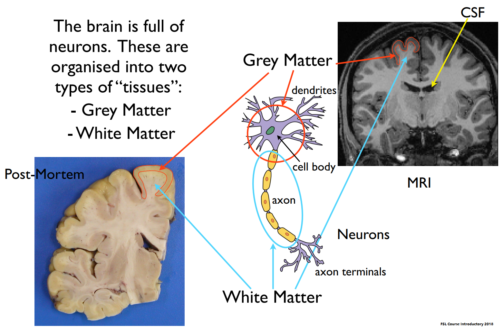
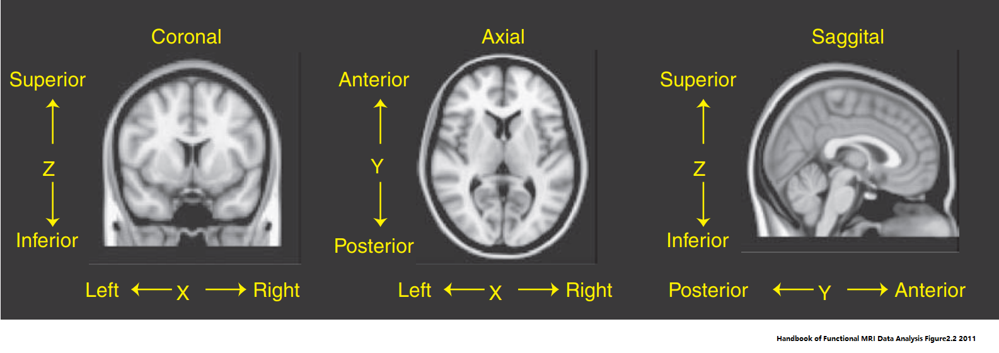

# <a id="toc_content">Content</a>
1. [Introduction](#toc1)
   1. [Abbreviation](#toc1.1)
1. [Basic](#toc2)
   1. [Brain Anatomy](#toc2.1)
   1. [Structural MRI](#toc2.2)
      1. [Measurement](#toc2.2.1)
      1. [Analysis](#toc2.2.2)
      1. [Limitation](#toc2.2.3)
      1. [Acquisition Tips](#toc2.2.4)
   1. [Theoretical Foundations of Brain Registration](#toc2.3)
      1. [Space](#toc2.3.1)
         1. [Coordinate Systems](#toc2.3.1.1)
         1. [Native Space and Standard Spaces](#toc2.3.1.2)
      1. [Spatial Transformations](#toc2.3.2)
      1. [Transformation Model](#toc2.3.3)
      1. [Cost Functions](#toc2.3.4)
      1. [Interpolation](#toc2.3.5)
      1. [Atlases and Templates](#toc2.3.6)
         1. [The Talairach Atlas](#toc2.3.6.1)
         1. [The MNI Templates](#toc2.3.6.2)
   1. [Theoretical Foundations of Brain Segmentation](#toc2.4)
      1. [Likelihood or Observation Models](#toc2.4.1)
         1. [Parameter and Non-parameter Model](#toc2.4.1.1)
         1. [Finite Mixture Model](#toc2.4.1.2)
         1. [Hidden Markov Random field Model](#toc2.4.1.3)
      1. [Prior Probability Models](#toc2.4.2)
         1. [Generalized MRF Prior](#toc2.4.2.1)
         1. [Template-base Priors](#toc2.4.2.2)
      1. [Optimization of Maximizing Posterior Probability](#toc2.4.3)
         1. [Atropos](#toc2.4.3.1)
         1. [HMRF-EM](#toc2.4.3.2)
   1. [Deep Learning Suits](#toc2.5)
1. [ADDL](#toc3)
   1. [ADNI Subjects](#toc3.1)
   1. [Preprocessing](#toc3.2)
      1. [Brain Extraction](#toc3.2.1)
      1. [Grey Matter Segmentation](#toc3.2.2)
      1. [Template Creation](#toc3.2.3)
      1. [Spatial Normalization](#toc3.2.4)
      1. [Correction for Volume Changes (Modulation)](#toc3.2.5)
      1. [Smoothing](#toc3.2.6)
   1. [Training and Validation Group](#toc3.3)
   1. [ResNet Module](#toc3.4)
   1. [Diagnostic Algorithm](#toc3.5)
1. [Reference](#toc4)

----
[
Back to Content
](#toc_content)

# <a id="toc1">Introduction</a>

## <a id="toc1.1">Abbreviation</a>
* *CNS* central nervous system
* *GM* grey matter or gray matter
* *WM* white matter
* *CSF* cerebrospinal fluid
* *MRI* Magnetic resonance imaging
* *VBM* Voxel-Based Morphometry
* *EM* Expectation-Maximization

----
[
Back to Content
](#toc_content)

# <a id="toc2">Basic</a>

## <a id="toc2.1">Brain Anatomy</a>
The central nervous system(CNS) has two kinds of tissue: grey matter and white matter, grey matter, which has a pinkish-grey color in the living brain, contains the cell bodies, dendrites and axon terminals of neurons, so it is where all synapses are. White matter is made of axons connecting different parts of grey matter to each other.

***Grey Matter*** 
Grey matter (or gray matter, GM) is a major component of the central nervous system, consisting of neuronal cell bodies, neuropil (dendrites and myelinated as well as unmyelinated axons), glial cells (astrocytes and oligodendrocytes), synapses, and capillaries. Grey matter is distinguished from white matter, in that it contains numerous cell bodies and relatively few myelinated axons, while white matter contains relatively few cell bodies and is composed chiefly of long-range myelinated axon tracts. The colour difference arises mainly from the whiteness of myelin. In living tissue, grey matter actually has a very light grey colour with yellowish or pinkish hues, which come from capillary blood vessels and neuronal cell bodies.

***White Matter*** 
White matter(WM) refers to areas of the central nervous system (CNS) that are mainly made up of myelinated axons, also called tracts. Long thought to be passive tissue, white matter affects learning and brain functions, modulating the distribution of action potentials, acting as a relay and coordinating communication between different brain regions.

White matter is named for its relatively light appearance resulting from the lipid content of myelin. However, the tissue of the freshly cut brain appears pinkish white to the naked eye because myelin is composed largely of lipid tissue veined with capillaries. Its white color in prepared specimens is due to its usual preservation in formaldehyde.

***Cerebrospinal Fluid*** 
Cerebrospinal fluid(CSF) is a clear, colorless body fluid found in the brain and spinal cord. It is produced in the choroid plexuses of the ventricles of the brain, and absorbed in the arachnoid granulations. There is about 125mL of CSF at any one time, and about 500mL is generated every day. CSF acts as a cushion or buffer for the brain, providing basic mechanical and immunological protection to the brain inside the skull. CSF also serves a vital function in cerebral auto regulation of cerebral blood flow.

## <a id="toc2.2">Structural MRI</a>
The Structural MRI reflect brain anatomy, and acquisition time depends on SNR and resolution(typ. 3-15mins), there are many different and good varieties of sequences to acquire these images.

### <a id="toc2.2.1">Measurement</a>
Three main measurement quantities involved density of water and fat(proton density), T1 weighted relaxation time ant T2 weighted relaxation time. The relaxation times depend on many things but are sensitive to micro-environment and hence tissue type.

### <a id="toc2.2.2">Analysis</a>
The analysis of structural MRI focus on quantify tissue volumes and structure shape and size. It could identify brain tissue types(GM/WM/CSF), sub-cortical structure and shape, cortical surface and thickness and local GM tissue change. The basic stages in the structural analysis pipeline brain extraction, tissue segmentation and registration.

### <a id="toc2.2.3">Limitations</a>
The structural MRI count not measure tissue type(GM/WM/CSF) directly, it is not quantitative. The GM and WM value are vary between T1 weighted and T2 weighted. The constrast of subcortical regions is poor. Single acquisition sequence does not show all pathologies. Especially the artifacts and noise of the MRI data is the major limitation of analysis.

There is always a trade-off in MRI between acquisition time, resolution and noise(SNR). For analysis the contrast to noise ratio(CNR) is often more important and contrast depends on MR sequence too.

### <a id="toc2.2.4">Acquisition Tips</a>
T1 weighted images tend to be the best for the SNR/time/resolution tradeoff, 1mm voxels are typical. There are many sequences names/types that give T1 weighted images and most are equally good, Use the locally optimised sequence on your scanner. If the subjects are likely to move a lot then offline averaging several shorter acquistions can be better. Sub-cortical contrast can be enhanced with different sequences or parameter choice. Turn on some fat-suppression helps brain extraction. Isotropic voxels are much better for analysis in general. Do not do upsampling on scanner.

## <a id="toc2.3">Theoretical Foundations of Brain Registration</a>

### <a id="toc2.3.1">Spaces</a>

#### <a id="toc2.3.1.1">Coordinate Systems</a>
Since MRI images are related to physical objects, we require some way to relate the data points in the image to spatial locations in the physical object. We do this using a coordinate system, which is a way of specifying the spatial characteristics of an image. The data matrix for a single brain image is usually three-dimensional, such that each dimension in the matrix corresponds to a dimension in space. By convention, these dimensions (or axes) are called X, Y , and Z. In the standard space used for neuroimaging data, X represents the left–right dimension, Y represents the anterior–posterior dimension, and Z represents the inferior–superior dimension.

In the data matrix, a specific voxel can be indexed as [Xvox, Yvox, Zvox], where these three coordinates specify its position along each dimension in the matrix. The specifics about how these data are stored (e.g., whether the first X value refers to the leftmost or rightmost voxel) are generally stored in the image header or image metadata.

#### <a id="toc2.3.1.2">Native Space and Standard Spaces</a>
The coordinate systems provide a link between the physical structures in the brain and the coordinates in the image. We call the original coordinate system in the images as they were acquired from the MRI scanner the native space of the image. Although the native space allows us to relate image coordinates to physical structures, the brains of different individuals (or the same individual scanned on different occasions) will not necessarily line up in native space. Different people have brains that are different sizes, and even when the same person is scanned multiple times, the brain will be in different places in the image depending upon exactly where the head was positioned in the scanner. Because many research questions in neuroimaging require us to combine data across individuals, we need a common space in which different individuals can be aligned. The first impetus for such a common space came from neurosurgeons, who desired a standardized space in which to perform stereotactic neurosurgery. Such spaces are now referred to generically as standard spaces or stereotactic spaces. The most famous of these is the approach developed by Jean Talairach (Talairach, 1967). More recently, a stereotactic coordinate space developed at the Montreal Neurological Institute (MNI) on the basis of a large number of MRI images has become a standard in the field.

### <a id="toc2.3.2">Spatial Transformations</a>
Several aspects of MRI analysis require spatially transforming images in some way, for example, to align images within individuals (perhaps to correct for head motion) or across individuals (in order to allow group analysis). There is an unlimited number of ways to transform an image. A simple transformation (with a small number of parameters) might move a structure in space without changing its shape, whereas a more complex transformation might match the shape of two complex structures to one another. In general, we will focus on methods that have relatively few parameters in relation to the number of voxels. We will also limit our focus to automated methods that do not require any manual delineation of anatomical landmarks, since these are by far the most common today. In this section, we only discuss volume-based transformations, which involve changes to a three-dimensional volume of data.

Two steps are necessary to align one image to another. First, we have to estimate the transformation parameters that result in the best alignment. This requires that we have a transformation model that specifies the ways in which the image can be changed in order to realign it. Each parameter in such a model describes a change to be made to the image. A very simple model may have only a few parameters; such a model will only be able to make gross changes and will not be able to align the fine details of the two images. A complex model may have many more parameters and will be able to align the images better, especially in their finer details. We also need a way to determine how misaligned the two images are, which we refer to as a cost function. It is this cost function that we want to minimize in order to find the parameters that best align the two images。

Once we have determined the parameters of the transformation model, we must then resample the original image in order to create the realigned version. The original coordinates of each voxel are transformed into the new space, and the new image is created based on those transformed coordinates. Since the transformed coordinates will generally not fall exactly on top of coordinates from the original image, it is necessary to compute what the intensity values would be at those intermediate points, which is known as interpolation. Methods of interpolation range from simple (such as choosing the nearest original voxel) to complex weighted averages across the entire image.

### <a id="toc2.3.3">Transformation Model</a>
***Affine Transformations*** 
The simplest transformation model involves the use of linear operators, also known as affine transformations. A feature of affine transformations is that any set of points that fell on a line prior to the transform will continue to fall on a line after the transform. Thus, it is not possible to make radical changes to the shape of an object (such as bending) using affine transforms. An affine transformation involves a combination of linear transforms, translation (shifting) along each axis, rotation around each axis, scaling (stretching) along each axis and shearing along each axis.

For a three-dimensional image, each of these operations can be performed for each dimension, and that operation for each dimension is represented by a single parameter. Thus, a full affine transformation where the image is translated, rotated, skewed, and stretched along each axis in three dimensions is described by 12 parameters. There are some cases where you might want to transform an image using only a subset of the possible linear transformations, which corresponds to an affine transformation with fewer than 12 parameters. For example, in motion correction we assume that the head is moving over time without changing its size or shape. We can realign these images using an affine transform with only six parameters (three translations and three rotations), which is also referred to as a rigid body transformation because it does not change the size or shape of the objects in the image.

***Piecewise Linear Transformation*** 
One extension of affine transformations is to break the entire image into several sections and allow different linear transforms within each of those sections. This is known as a piecewise linear transformation. Piecewise linear transformations were employed in one of the early methods for spatial normalization of brain images, developed by Jean Talairach.

***Nonlinear Transformations*** 
Nonlinear transformations offer much greater flexibility in the registration of images than affine transformations, such that different images can be matched much more accurately. There is a very wide range of nonlinear transformation techniques available, and we can only scratch the surface here; for more details, see Ashburner & Friston (2007) and Holden (2008). Whereas affine transformations are limited to linear operations on the voxel coordinates, nonlinear transformations allow any kind of operation. Nonlinear transforms are often described in terms of basis functions, which are functions that are used to transform the original coordinates. The affine transforms described earlier were one example of basis functions. However, basis function expansion also allows us to re-represent the coordinates in a higher-dimensional form, to allow more complex transformation.

Another nonlinear basis function set that is commonly encountered in MRI data analysis is the discrete cosine transform (DCT) basis set, which historically was used in SPM (Ashburner & Friston, 1999), though more recently has been supplanted by spline basis functions. This basis set includes cosine functions that start at low frequencies (which change very slowly over the image) and increase in frequency. It is closely related to the Fourier transform. Each of the cosine functions has a parameter associated with it; the lower-frequency components are responsible for more gradual changes, whereas the higher-frequency components are responsible for more localized changes.

For all nonlinear transformations, the greater the number of parameters, the more freedom there is to transform the image. In particular, high-dimensional transformations allow for more localized transformations; whereas linear transforms necessarily affect the entire image in an equivalent manner, nonlinear transforms can change some parts of the image much more drastically than others.

### <a id="toc2.3.4">Cost Functions</a>
***Least Squares*** 
The least-squares cost function is perhaps the most familiar, as it is the basis for most standard statistical methods. This cost function measures the average squared difference between voxel intensities in each image,  
  
where Av and Bv refer to the intensity of the vth voxel in images A and B, respectively. Because it measures the similarity of values at each voxel, the least-squares cost function is only appropriate for within-modality registration. Even within modalities, it can perform badly if the two images have different intensity distributions (e.g., one is brighter overall than the other or has a broader range of intensities). One approach, which is an option in the AIR software package, is to first scale the intensity distributions before using the least-squares cost function so that they fall within the same range across images.

***Normalized Correlation*** 
Normalized correlation measures the linear relationship between voxel intensities in the two images.  
  
This measure is appropriate for within-modality registration only. In a comparison of many different cost functions for motion correction, Jenkinson et al. (2002) found that normalized correlation results in more accurate registration than several other cost functions, including least squares. It is the default cost function for motion correction in the FSL software package.

***Mutual Information*** 
Whereas the cost functions described earlier for within-modality registration have their basis in classical statistics, the mutual information cost function (Pluim et al., 2003) (which can be used for between- or within-modality registration) arises from the concept of entropy from information theory. Entropy refers to the amount of uncertainty or randomness that is present in a signal,  
  
where pi is the probability of each possible value xi of the variable; for continuous variables, the values are grouped into N bins, often called histogram bins. Entropy measures the degree to which each of the different possible values of a variable occurs in a signal. If only one signal value can occur, then the entropy is minimized. If every different value occurs equally often, then entropy is maximized. In this way, it bears a close relation to the variance of a signal, and also to the uncertainty with which one can predict the next value of the signal. Entropy can be extended to multiple images by examining the joint histogram of the images, which plots the frequency of combinations of intensities across all possible values for all voxels in the images. If the two images are identical, then the joint histogram has values along the diagonal only, because the values will be identical in the voxels in each image, whereas differences between the images leads to a greater dispersion of values across the histogram; note that for this within-modality case, correlation would be a more appropriate cost function measure than mutual information (MI). For images from different modalities, where mutual information is more appropriate, greater misregistration leads to greater dispersion in the joint histogram. The joint entropy of two images A and B can then be computed from this joint histogram as  
  
where i indexes values of A and j indexes values of B. This measure is lowest when the values of an image B are perfectly predictable by the value of the same voxel in image A.

Mutual information is the difference between the total entropy of the individual images and the joint entropy,  
  
where H(A) and H(B) are the entropies computed separately for the values in each image respectively (known as marginal entropy), and H(A,B) is the joint entropy. Mutual information is greatest when the joint entropy is least, which occurs when the values of one image are maximally predictable from the other image. Thus, mutual information can serve as a measure of similarity between two images.

One potential problem with mutual information is that in some cases, mutual information can increase even as the overlap between images decreases. For this reason, normalization of the mutual information coefficient has been suggested (Studholme et al., 1999),  
 

All of the major software packages (FSL, SPM, and AFNI) offer both regular and normalized mutual information cost functions for image registration.

***Correlation Ratio*** 
The correlation ratio (Roche et al., 1998) measures how well the variance in one measure is captured by the variance in another measure. The correlation ratio for two images A and B is defined as  
  
where k is an index to each unique value of B and N is the number of unique values of B. If the A and B are identical, then across all voxels having some particular value of B there will be no variance in the values of A, and the correlation ratio becomes zero. This measure is similar to the Woods criterion first implemented for PET-MRI corgistration in the AIR software package (Woods et al., 1993), though it does behave differently in some cases (Jenkinson & Smith, 2001). It is suitable for both within-modality and between-modality registration and is the default between modality cost function in the FSL software package.

### <a id="toc2.3.5">Interpolation</a>
***Nearest Neighbor Interpolation*** 
In nearest neighbor interpolation, the value of the new voxel is replaced with the value of the nearest voxel in the original image. This form of interpolation is rarely used, as it suffers from a number of problems. First, it can result in resliced images that look “blocky” and generally suffer from a loss of resolution. This is especially evident when the interpolation is performed multiple times on the same image. Second, continuous changes in transformation parameters can result in discontinuous changes in cost function values when using nearest neighbor interpolation, which makes it unsuitable for use with optimization methods (which often assume that cost functions are continuous).

The one case in which nearest neighbor interpolation is preferred is to transform images where the voxel values represent labels rather than physical intensities. For example, the anatomical atlases that are included with some software packages are stored as images with specific but arbitrary values corresponding to each structure in the atlas (e.g., voxels in hippocampus have a value of 12, and those in the amygdala have a value of 20). Using an interpolation method that averaged between these numbers would give nonsensical results, so nearest neighbor interpolation would be used to ensure that the label values in the transformed image retain the same exact values as those in the original image.

***Linear Interpolation*** 
This method, often referred to as tri-linear interpolation when it is applied in three dimensions, involves taking a weighted average of the values at each of the nearest points in the original image. This method has the benefit of being relatively fast compared to higher-order interpolation methods, since it only takes into account those points immediately adjacent to the new location. However, it tends to blur the image somewhat more than higher-order interpolation methods, such assinc interpolation.

***Higher-order Interpolation*** 
A number of interpolation methods have been developed that integrate information across a broader set of voxels than nearest neighbor (which uses only the single nearest voxel) and linear interpolation (which integrates across the eight nearest voxels in three dimensions). The most commonly encountered higher-order interpolation method is sinc interpolation, which uses a sinc function [sinc(x) = sin(x)/x]. In principle this form of interpolation should use information from every voxel in the image, since the sinc function extends to infinity. However, this would be computationally very expensive. To make Sinc interpolation is more feasible through the use of a windowed sinc function, wherein the function only extends a limited distance from the point being interpolated, rather than encompass the entire image. There are many different forms of windows that can be applied; common options include Hanning and rectangular windows. The Hanning window appears to lead to decreased interpolation errors relative to the rectangular window (Ostuni et al., 1997), and thus should be chosen if available, using a window with a radius (or half-length) of at least four voxels.

Another form of higher-order interpolation uses basis functions, as spatial transformation models. Basis functions, such as B-splines, provide a more generalized approach to interpolation, which can encompass nearest neighbor and linear interpolation as well as higher-order nonlinear interpolation.

### <a id="toc2.3.6">Atlases and Templates</a>
An atlas provides a guide to the location of anatomical features in a coordinate space. A template is an image that is representative of the atlas and provides a target to which individual images can be aligned. A template can comprise an image from a single individual or an average of a number of individuals. Whereas atlases are useful for localization of activation and interpretation of results, templates play a central role in the spatial normalization of MRI data.

#### <a id="toc2.3.6.1">The Talairach Atlas</a>
The Talairach atlas The best-known brain atlas is the one created by Talairach (1967) and subsequently updated by Talairach & Tournoux (1988). This atlas provided a set of saggital, coronal, and axial sections that were labeled by anatomical structure and Brodmann’s areas. Talairach also provided a procedure to normalize any brain to the atlas, using the set of anatomical landmarks. Once data have been normalized according to Talairach’s procedure, the atlas provides a seemingly simple way to determine the anatomical location at any particular location.

While it played a seminal role in the development of neuroimaging, the Talairach atlas and the coordinate space associated with it are problematic (Devlin & Poldrack, 2007).  With regard to spatial normalization, a major problem is that there is no MRI scan available for the individual on whom the atlas is based, so an accurate MRI template cannot be created. This means that normalization to the template requires the identification of anatomical landmarks that are then used to guide the normalization; such landmark-based normalization has generally been rejected in favor of automated registration to image-based templates.

#### <a id="toc2.3.6.2">The MNI Templates</a>
The most common templates used for spatial normalization are those developed at the Montreal Neurological Institute, known as the MNI templates. These templates were developed to provide an MRI-based template that would allow automated registration rather than landmark-based registration. The first widely used template, known as MNI305, was created by first aligning a set of 305 images to the Talairach atlas using landmark-based registration, creating a mean of those images, and then realigning each image to that mean image using a nine-parameter affine registration (Evans et al., 1993). Subsequently, another template, known as ICBM-152, was developed by registering a set of higher-resolution images to the MNI305 template. Versions of the ICBM-152 template are included with each of the major software packages. It is important to note that there are slight differences between the MNI305 and ICBM-152 templates, such that the resulting images may differ in both size and positioning depending upon which template is used (Lancaster et al., 2007)

## <a id="toc2.4">Theoretical Foundations of Brain Segmentation</a>
Bayes’ theorem provides a powerful mechanism for making inductive inferences assuming the availability of quantities defining the relevant conditional probabilities, specifically the likelihood and prior probability terms. Bayesian paradigms for brain image segmentation employ a user selected observation model defining the likelihood term and one or more prior probability terms. The product of likelihood(s) and prior(s) is proportional to the posterior probability. The likelihood term is defined  parametrically (e.g. a Gaussian model) or non-parametrically (e.g. Parzen windowing of the sample histogram). The prior term, as given in the literature, has often been formed either as MRF-based and/or template-based. An image segmentation solution in this context is an assignment of one label to each voxel such that the posterior probability is maximized.

A generic Bayesian framework(Sanjay-Gopal and Hebert, 1998) requires likelihood models and prior models which enter into Bayes formula,  
  
where the normalization term is a constant that does not affect the optimization. Given choices for likelihood models and prior probabilities, the Bayesian segmentation solution is the labeling x̂ which maximizes the posterior probability.  
  
The EM framework (Dempster et al. 1977) to find maximum likelihood solutions to this problem.

The next sections introduce three essential components in Bayesian segmentation, the likelihood or observation model(s), the prior probability quantities derived from a generalized MRF and template-based prior terms, and the optimization framework for maximizing the posterior probability. These components are common across most EM segmentation algorithms.

### <a id="toc2.4.1">Likelihood or Observation Models</a>

#### <a id="toc2.4.1.1">Parameter and Non-parameter Model</a>
To each of the labels corresponds a single probabilistic model describing the variation of location over image domain as voxel-wise probability. We can define these voxel-wise probabilities in either parametric or non-parametric case.

In the parametric case, given its simplicity and good performance, voxel-wise probability is typically defined as a normal distribution.  
  
where k is the label index. When the observation is a vector quantity, we replace the Euclidean distance by Mahalanobis distance and define multivariate Gaussian parameters via a mean vector and covariance matrix.

A common technique for the non-parametric variant is to define voxel-wise probability using Parzen windowing of the sampled observation histogram.  
  
where the  is the number of bins used to define the histogram of the sample observations. For multimodal data in which the number of components of observation is greater than one, a Parzen window function is constructed for each component. The likelihood value is determined by the joint probability given by their product.

#### <a id="toc2.4.1.2">Finite Mixture Model</a>
The finite mixture model(FMM) segmentation likelihood estimates are most commonly used model because of its simple mathematical forma and the piecewise constant nature of ideal brain MRI. FMM assumes independency between voxels to calculate the probability associated with the entire set of observations. Spatial interdependency between voxels is modeled by the prior probabilities.  
  
where the  is the mixing parameter, K is the number of label types, N is total number of observations.

The FMM is the Atropos segmentation likelihood estimates of ITK package.

#### <a id="toc2.4.1.3">Hidden Markov Random Field Model</a>
A novel hidden Markov random field (HMRF) model, which is a stochastic process generated by a MRF whose state sequence cannot be observed directly but which can be indirectly estimated through observations. Mathematically, it can be shown that the FMM is a degenerate version of the HMRF model. The advantage of the HMRF model derives from the way in which the spatial information is encoded through the mutual influences of neighboring sites.

The HMRF model is the segmentation likelihood estimates of FAST package.

### <a id="toc2.4.2">Prior Probability models</a>

#### <a id="toc2.4.2.1">Generalized MRF Prior</a>
One may incorporate spatial coherence into the segmentation by favoring labeling configurations in which voxel neighborhoods tend towards homogeneity. This intuition is formally described by MRF theory in which spatial interactions in voxel neighborhoods can be modeled (Li 2001).

Base on the MRF theory and Hanmmersley-Clifford theorem get the prior modeled equation,  
  
where the partition function is a normalization factor, and the energy function is only composed of a sum over pairwise interactions between neighboring sites across the image,  
  
where the granularity term weights the contribution of the MRF prior on the segmentation solution. The potential is typically defined in terms of the Kronecker delta, based on the classical Ising potential (also known as a Potts model) (Besag 1974).  
  

#### <a id="toc2.4.2.2">Template-based Priors</a>
A number of researchers have used templates to both ensure spatial coherence and incorporate prior knowledge in segmentation. A common technique is to select labeled subjects from a population from which a template is constructed (e.g. Avants et al. 2010). Each labeling can then be warped to the template where the synthesis of warped labeled regions produces a prior probability map or prior label map encoding the spatial distribution of labeled anatomy which can be harnessed in joint segmentation/registration or Atropos/ANTs hybrids involving unlabeled subjects.

We employ the strategy given in Ashburner and Friston (2005) in which the stationary mixing proportions, the prior probability that a label corresponds to a particular voxel, regardless of intensity, are replaced by the following spatially varying mixing proportions of a label,  
  
where  is the mixing parameter. The  is the prior probability value at site i of label k which was mapped, typically by image registration, to the local image from a template data set.

### <a id="toc2.4.3">Optimization of Maximizing Posterior Probability</a>

#### <a id="toc2.4.3.1">Atropos</a>
Atropos uses expectation maximization to find a locally optimal solution for the user selected version of the Bayesian segmentation problem. After initial estimation of the likelihood model parameters, EM iterates between calculation of the missing optimal labels x̂ and subsequent re-estimation of the model parameters by maximizing the expectation of the complete data log-likelihood. The expectation maximization procedure is derived in various publications including Zhang et al. (2001) which yields the optimal mean and variance (or covariance), but sets the mixing parameter as a constant.

The Atropos implementation estimates mixing parameter at each iteration, similar to Ashburner and Friston (2005). When spatial coherence constraints are included as an MRF prior in Atropos, the optimal segmentation solution becomes intractable. Although many optimization techniques exist (see the introduction in Marroquin et al. (2002) for a concise summary of the myriad optimization possibilities)—each with their characteristic advantages and disadvantages in terms of computational complexity and accuracy—Atropos uses the well known Iterated Conditional Modes (ICM Besag 1986) which is greedy, computationally efficient and provides good performance.

***Initialization ***
In all cases, the user defines the number of classes to segment. The simplest initialization is by the classic K-means or Otsu thresholding algorithms with only the number of classes specified by the user. Otherwise, the user must provide prior information for each class in the form of either a single n-ary prior label image or a series of prior probability images, one for each class. The initialization also provides starter parameters.

***Label Update(E-Step)*** 
Given the initialization and fixed model parameters, Atropos is capable of updating the current label estimates using either a synchronous or asynchronous scheme. The former is characterized by iterating through the image and determining which label maximizes the posterior probability without updating any labels until all voxels in the mask have been visited at which point all the voxel labels are updated simultaneously (hence the descriptor “synchronous”). However, unlike asynchronous schemes characteristic of ICM, synchronous updates lack convergence guarantees. To determine the labeling which maximizes the posterior probability for the asynchronous option, an “ICM code” image is created once for all iterations by iterating through the image and assigning an ICM code label to each voxel in the mask such that each MRF neighborhood has a non-repeating code label set. Thus each masked voxel in the ICM code image is assigned a value in the range {1, …, C} where C is the maximum code label. Such an image can be created and viewed. For each iteration, one has the option to permute the set {1, …, C} which prescribes the order in which the voxel labels are updated asynchronously. After the first pass through the set of code labels, additional passes can further increase the posterior probability until convergence (in ~5 iterations). One can specify a maximum number of these “ICM iterations” on the command line.

***Parameter Update(M-Step)*** 
Note that the posteriors used in the previous iteration are used to estimate the parameters at the current iteration. We use a common and elementary estimate of the mixing parameters.  
  
Update the parametric model parameters by computing, for each of K labels, the mean,  
  
and variance,  
  
The latter two quantities are modified, respectively, in the case of multivariate data as follows,  
  
and the covariance matrix is calculated from  
  
This type of update is known as soft EM. Hard EM, in contrast, only uses sites containing a label to update the parameters for the matching model. A similar pattern is used in nonparametric cases.

EM will iterate toward a local maximum. We track convergence by summing up the maximum posterior probability at each site over the segmentation domain. The label update step above, depends upon the selected coding strategy (Besag 1986). Atropos may use either a classical, sequential checkerboard update or a synchronous update of the labels, the latter of which is commonly used in practice. Synchronous update does not guarantee convergence but we employ it by default due to its intrinsic parallelism and speed. The user may alternatively select checkerboard update if he or she desires theoretical convergence guarantees. However, we have not identified performance differences, relative to ground truth, that convince us of the absolute superiority of one approach over the other.

#### <a id="toc2.4.3.2">HMRF-EM</a>
To fit the HMRF model, an EM algorithm is used. We show that by incorporating both the HMRF model and the EM algorithm into a HMRF-EM framework, an accurate and robust segmentation can be achieved. The Atropos borrowed most detail above, which refer to Zhang 2001. The FAST package is the algorithm implementation.

## <a id="toc2.5">Deep Learning Suits</a>
TBD

----
[
Back to Content
](#toc_content)

# <a id="toc3">ADDL</a>
The ADDL project is based on structural MRI (T1, 2017) data of Alzheimer's disease(AD) and non-Alzheimer's disease subjects in ADNI. It uses ResNet to learn the brain gray matter tissue images obtained through preprocessing, and combines diagnostic algorithms to achieve The diagnosis of AD, with a diagnostic accuracy of more than 87%.

The ADDL project includes four processes: preprocessing, grouping, training and diagnosis. In the pre-process, the structural MRI (T1) data of all the subjects in the study group were segmented and registered to obtain the gray matter image. The grouping process divides the subjects in the study group into a training set and a validation set. The training process is to input training set data into ResNet model training. In the diagnosis process, the gray matter image of a subject in the test group is input into the trained ResNet model, and a diagnostic algorithm is applied to determine whether the subject suffers from Alzheimer's disease.

This chapter introduces the algorithms used in ADDL from five aspects: ADNI subjects, preprocessing, grouping, ResNet model, and diagnostic algorithm.

## <a id="toc3.1">ADNI Subjects</a>
TBD, integrate the previous spreadsheet.

## <a id="toc3.2">Preprocessing</a>
The preprocessing applies the segmentation algorithm to the original structure MRI image (T1) data of all the subjects to obtain the GM tissue, and transforms the GM data in native space  base on the same template to the spatial space. With respect to segmentation, the brain tissues (GM/WM) were extracted and segmented using the ANTsR tool from the original structural MRI data of all subjects; then the GM obtained from the previous section was extracted using the FAST tool. With regard to registration, a study registration template is first generated based on the GM template of the ICBM-152 GM template of all the subjects; then the generated template is used to spatial transformation of GM in native space into a new spatial space; then a modulation process holds the volume of each voxel after the registration; finally step is the smoothing process.

This section will introduce the six parts of the preprocessing process, brain extraction, GM segmentation, template creation, spatial transformation normalization, voxel volume modulation, and smoothing.

### <a id="toc3.2.1">Brain Extraction</a>
This is a fully automated procedure to remove scalp tissue, skull, and dural venous sinus voxels. This procedure initially involves segmentation of the original structural MR images (in native space) into grey and white matter images, followed by a series of fully automated morphological operations for removing unconnected non-brain voxels from the segmented images (erosion followed by conditional dilation). The resulting images are extracted grey and white matter partitions in native space.

### <a id="toc3.2.2">Grey Metter Segmentation</a>
Scans were then segmented into grey matter, white matter, CSF, and other nonbrain partitions. SPM segmentation employs a mixture model cluster analysis to identify voxel intensities matching particular tissue types (grey matter, white matter and CSF) combined with an a priori knowledge of the spatial distribution of these tissues in normal subjects, derived from probability maps. The segmentation step also incorporates an image intensity nonuniformity correction (Ashburner and Friston, 2000) to address image intensity variations caused by different positions of cranial structures within the MRI head coil.

Scans were then segmented into grey matter, white matter, CSF, and other nonbrain partitions. SPM segmentation employs a mixture model cluster analysis to identify voxel intensities matching particular tissue types (grey matter, white matter and CSF) combined with an a priori knowledge of the spatial distribution of these tissues in normal subjects, derived from probability maps. The segmentation step also incorporates an image intensity nonuniformity correction (Ashburner and Friston, 2000) to address image intensity variations caused by different positions of cranial structures within the MRI head coil.

### <a id="toc3.2.3">Template Creation</a>
First, an anatomical template was created from a subgroup of all normal subjects with a mean age and age range matched to the entire study group imaged on the same MRI scanner with the same scanning parameters, in order to reduce any scanner-specific bias and provide a template appropriate to the population sample. This involves spatially normalizing each structural MRI to the ICBM-152 template (Montreal Neurological Institute), which is derived from 152 normal subjects and approximates the Talairach space. The normalized data are then smoothed with an 8-mm full-width at half-maximum (FWHM) isotropic Gaussian kernel, and a mean image (the template) is created.

### <a id="toc3.2.4">Spatial Normalization</a>
All subjects' structural MRI scans (in native space) were transformed to the same stereotactic space by registering each of the images to the same template image, using the residual sum of squared differences as the matching criterion(lose function). The first step in spatial normalization involves estimating the optimum 12-parameter affine transformation to match images (Ashburner et al., 1997). A Bayesian framework is used, whereby the maximum a posteriori (MAP) estimate of the spatial transformation is made using prior knowledge of the normal variability in brain size. The second step accounts for global non-linear shape differences, which are modeled by a linear combination of smooth spatial basis functions (Ashburner and Friston, 1999). A masking procedure is used to weight the normalization to brain rather than nonbrain tissue. The spatially normalized images are resliced with a final voxel size of approximately.

### <a id="toc3.2.5">Correction for Volume Changes (Modulation)</a>
As a result of nonlinear spatial normalization, the volumes of certain brain regions may grow, whereas others may shrink. In order to preserve the volume of a particular tissue (grey or white matter or CSF) within a voxel, a further processing step is incorporated. This involves multiplying (or modulating) voxel values in the segmented images by the Jacobian determinants derived from the spatial normalization step. In effect, an analysis of modulated data tests for regional differences in the absolute amount (volume) of grey matter, whereas analysis of unmodulated data tests for regional differences in concentration of grey matter (per unit volume in native space) (Ashburner and Friston, 2000).

### <a id="toc3.2.6">Smoothing</a>
The normalized, segmented images are smoothed using a 12-mm FWHM isotropic Gaussian kernel. This conditions the data to conform more closely to the Gaussian field model underlying the statistical procedures used for making inferences about regionally specific effects. Smoothing also has the effect of rendering the data more normally distributed (by the central limit theorem). The intensity in each voxel of the smoothed data is a locally weighted average of grey matter density from a region of surrounding voxels, the size of the region being defined by the size of the smoothing kernel (Ashburner and Friston, 2000).

## <a id="toc3.3">Training and Validation Group</a>
All the subjects are grouped as training and validation two sets, that the training set is used for update ResNet module parameters, but the validation set will never attend the ResNet training process. If training set subject attend diagnostic process, it will be 100% accuracy. Keeping the AD and non-AD subjects and data ratio with the same distribution in the training and validation sets to avoid the bias, considering the subjects visited number are different in ADNI, ADNI involved the group tools base on statistics data of subjects, (and the AD and non-AD ratio is configurable.

## <a id="toc3.4">ResNet Module</a>
TBD: Introduction the detail of resnet module.

## <a id="toc3.5">Diagnostic Algorithm</a>
The output of ResNet module of the diagnostic process are a vector of labels, which reflect the AD predication values of images along the Z axon. Considering the different GM location or the tissue connection might indication the AD features, for better accuracy we weighted each element of the label vector as the quantity of diagnostic.

----
[
Back to Content
](#toc_content)

# <a id="toc4">Reference</a>

1	<a id="r1">[Saman Sarraf, DeepAD: Alzheimer's Disease Classification via Deep Convolutional Neural Networks using MRI and fMRI, doi: http://dx.doi.org/10.1101/070441, 2016]()</a>
1	<a id="r2">[Alex Krizhevsky, ImageNet Classification with Deep Convolutional Neural Networks]()</a>
1	<a id="r3">[Brian B. Avants, A Reproducible Evaluation of ANTs Similarity Metric Performance in Brain Image Registration, doi:10.1016/j.neuroimage.2010.09.025]()</a>
1	<a id="r4">[Max A. Viergever , A survey of medical image registration – under review, 2016]()</a>
1	<a id="r5">[J. B. Antoine Maintz, A survey of medical image registration, Medical Image Analysis (1998) volume 2, number 1, pp 1–36]()</a>
1	<a id="r6">[Kate E. Macdonald , Automated Template-Based Hippocampal Segmentations from MRI: The Effects of 1.5T or 3T Field Strength on Accuracy, DOI 10.1007/s12021-013-9217-y, 2014]()</a>
1	<a id="r7">[Fatma El-Zahraa Ahmed El-Gamal, Current trends in medical image registration and fusion, Egyptian Informatics Journal (2016) 17, 99–124, 2015]()</a>
1	<a id="r8">[Matthew Lai, Deep Learning for Medical Image Segmentation, arXiv:1505.02000v1, 2015]()</a>
1	<a id="r9">[Shumao Pang, Hippocampus Segmentation Based on Local Linear Mapping, DOI: 10.1038/srep45501, 2016]()</a>
1	<a id="r10">[Yongfu Hao, Local Label Learning (L3) for Multi-Atlas based Segmentation, doi: 10.1117/12.911014, 2012]()</a>
1	<a id="r11">[Yoshua Bengio, Representation Learning: A Review and New Perspectives, rXiv:1206.5538v3, 2014]()</a>
1	<a id="r12">[Guorong Wu, Scalable High Performance Image Registration Framework by Unsupervised Deep Feature Representations Learning, doi:10.1109/TBME.2015.2496253, 2016]()</a>
1	<a id="r13">[Guorong Wu, Unsupervised Deep Feature Learning for Deformable Registration of MR Brain Images, Med Image Comput Comput Assist Interv. 2013 ; 16(0 2): 649–656., 2014]()</a>
1 <a id="r14">[Hiba A. Mohammed, The Image Registration Techniques for Medical Imaging (MRI-CT), doi:10.5923/j.ajbe.20160602.02, 2016]()</a>
1 <a id="r15">[Hajnal, J. V., Hawkes, D. J., & Hill, D. L. (2001). Medical Image Registration. CRC Press.]()</a>