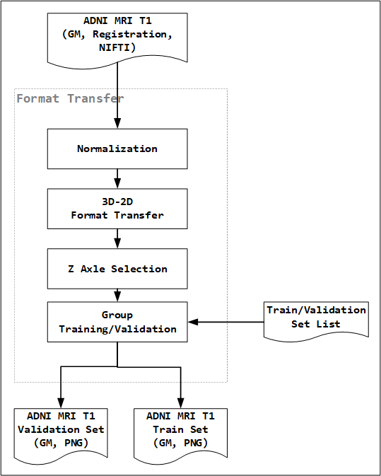

<a id="toc_content">**Content**</a>
1. [ADDL Introduction](#toc1)
1. [Preprocessing](#toc2)
   1. [Brain Extraction](#toc2.1)
   1. [Grey Matter Segmentation](#toc2.2)
   1. [Template Creation](#toc2.3)
      1. [Affine Registration](#toc2.3.1)
      1. [Non-Linear Registration](#toc2.3.2)
      1. [Template Generation](#toc2.3.3)
   1. [Non-Linear Registration](#toc2.4)
   1. [Modulation](#toc2.5)
   1. [Smooth](#toc2.6)
1. [Format Transform](#toc3)
   1. [Normalization](#toc3.1)
   1. [3D-2D Format Transfer](#toc3.2)
   1. [Z Axle Selection](#toc3.3)
   1. [Training and Validation Group](#toc3.4)
1. [Package Binary](#toc4)
1. [ResNet](#toc5)
1. [Diagnostic](#toc6)
1. [Reference](#toc7)

----
[
*Back to Content*
](#toc_content)

# <a id="toc1">1. ADDL Introduction</a>
The ADDL project bases on structural MRI (T1, 2017) data of Alzheimer's disease(AD) and non-Alzheimer's disease(NL) subjects of ADNI. It takes ResNet DL module to learn the brain gray matter(GM) images obtained through preprocessing, and applies diagnostic algorithm on the ResNet module inference results for the AD diagnostic.

The ADDL pipeline above shows the project workflow, it contains four processes, preprocessing, format transfer, training and inference. The preprocessing extracts GM from ADNI MRI T1 data, and handle GM registration cross study group. The format transfer process changes the data format from NIFTI to PNG and parts all the PNG data into two sets train and validation. The training process packages the train set PNG and the matching labels(AD/NL) into binary, feeds binary into ResNet module for training, and gets the ResNet module parameters till the network convergence. The inference process packages the validation set PNG by subject into binary, feeds the binary into trained ResNet module, and gets the AD diagnostic result base on the diagnostic algorithm.   

----
[
*Back to Content*
](#toc_content)

# <a id="toc2">2. Preprocessing</a>
The preprocessing stage gets GM from ADNI MRI T1 data. We use [FSL-VBM](http://fsl.fmrib.ox.ac.uk/fsl/fslwiki/FSLVBM) as the  preprocess tool, and replace several component with [ANTsR](https://github.com/ANTsX/ANTsR).

>"Structural data was analysed with FSL-VBM (Douaud et al., 2007, http://fsl.fmrib.ox.ac.uk/fsl/fslwiki/FSLVBM)\[[1](#r1)\], an optimised VBM protocol (Good et al., 2001)\[[2](#r2)\] carried out with FSL tools (Smith et al., 2004)\[[3](#r3)\]. First, structural images were brain-extracted and grey matter-segmented before being registered to the MNI 152 standard space using non-linear registration (Andersson et al., 2007)\[[4](#r4)\]. The resulting images were averaged and flipped along the x-axis to create a left-right symmetric, study-specific grey matter template. Second, all native grey matter images were non-linearly registered to this study-specific template and "modulated" to correct for local expansion (or contraction) due to the non-linear component of the spatial transformation. The modulated grey matter images were then smoothed with an isotropic Gaussian kernel with a sigma of ?? mm. Finally, voxelwise GLM was applied using permutation-based non-parametric testing, correcting for multiple comparisons across space."
>
>
-- Referencing FSL-VBM

The figure above shows the FSL-VBM work flow details. The index of each process matches with the preprocess [sources](../src/1.DataPreprocessing) file name.

Please refer to [ADDL basic](ADDL_basic.md#toc3.6.2) document for the MNI-152 standard template information. This project uses MNI-152 template from the FSL package.

----
[
*Back to Content*
](#toc_content)

## <a id="toc2.1">2.1 Brain Extraction</a>
The brain extraction gets the brain tissue from ADNI MRI full brain data, it is a necessary process for the following GM segmentation for the better result.

We use [`abpBrainExtraction`](https://www.rdocumentation.org/packages/ANTsR/versions/1.0/topics/abpBrainExtraction) of ANTsR as the brain extraction tool, and the [`abpN4`](https://www.rdocumentation.org/packages/ANTsR/versions/1.0/topics/abpN4) is not involved for outlier intensities truncates and bais corrects, because ADNI standard MRI T1 sequence contains [N3 correction](http://adni.loni.usc.edu/methods/mri-analysis/mri-pre-processing/). Note that we ignore the N3 and N4 difference.

The brain mask of MNI-152 template register to all the ADNI MRI data with affine and non-linear spatial transformation(FMM), and then gets the brain with the matching brain mask registered.

----
[
*Back to Content*
](#toc_content)

## <a id="toc2.2">2.2 Grey Matter Segmentation</a>
After the brain extraction stage, the GM segmentation stage gets all the ADNI subjects GM tissues data in native space, which is the start point of following GM registration processes.

We use [`FAST`](https://fsl.fmrib.ox.ac.uk/fsl/fslwiki/FAST)\[[5](#r5)\] of FSL package as the GM segmentation tool.

>FAST (FMRIB's Automated Segmentation Tool) segments a 3D image of the brain into different tissue types (Grey Matter, White Matter, CSF, etc.), whilst also correcting for spatial intensity variations (also known as bias field or RF inhomogeneities). The underlying method is based on a hidden Markov random field model and an associated Expectation-Maximization algorithm. The whole process is fully automated and can also produce a bias field-corrected input image and a probabilistic and/or partial volume tissue segmentation. It is robust and reliable, compared to most finite mixture model-based methods, which are sensitive to noise.
>
>
-- FAST Research Overview

----
[
*Back to Content*
](#toc_content)

## <a id="toc2.3">2.3 Template Creation</a>
Template creation gets a study group specify GM template from all the subjects GM data of study group, which is used for the GM registration. It applies affine registration for all the study group GM data base on MNI152, and gets a template named MNI152-ADI affine. And then it applies non-linear registration for all the study group GM data base on MNI152-ADNI affine template, and gets the result template for the following GM registration process.

----
[
*Back to Content*
](#toc_content)

### <a id="toc2.3.1">2.3.1 Affine Registration</a>
Please check the [ADNI basic](ADDL_basic.md#toc3.3) for the affine registration detail.

The project use [`fsl_reg`](https://manned.org/fsl4.1-fsl_reg/baac7ea7) of FSL as the affine registration tools at this stage.

----
[
*Back to Content*
](#toc_content)

### <a id="toc2.3.2">2.3.2 Non-Linear Registration</a>
Please check the [ADNI basic](ADDL_basic.md#toc3.3) for the non-linear registration detail.

The project uses [`ants_regwrite`](https://rdrr.io/github/neuroconductor/extrantsr/man/ants_regwrite.html) of extrantsr as the non-linear registration tool at this stage.

----
[
*Back to Content*
](#toc_content)

### <a id="toc2.3.4">2.3.4 Template Generation</a>
The template generation gets a template for the study group, it contains the average and left-right mirror operations. The average makes the template contains all the subjects information, and the left-right mirror is from the brain left-right symmetric.

The project use [`fslmerge`](https://www.rdocumentation.org/packages/fslr/versions/2.0/topics/fslmerge), [`fslmaths`](https://mandymejia.wordpress.com/fsl-maths-commands/) and [`fslswapdim`](https://www.rdocumentation.org/packages/fslr/versions/2.0/topics/fslswapdim) of FSL for the template generation tools.

----
[
*Back to Content*
](#toc_content)

## <a id="toc2.4">2.4 Non-Linear Registration</a>
This non-linear registration stage perform spatial normalization for all ADNI study group subjects' GM data base on the study group template generated at [section 2.3](#toc2.3).

The project uses [`antsRegistration`](https://www.rdocumentation.org/packages/ANTsR/versions/1.0/topics/antsRegistration) of ANTsR as the non-linear registration tool at this stage.

----
[
*Back to Content*
](#toc_content)

## <a id="toc2.5">2.5 Modulation</a>
As a result of nonlinear spatial normalization, the volumes of certain brain regions may grow, whereas others may shrink. In order to preserve the volume of a particular tissue (grey or white matter or CSF) within a voxel, a further processing step is incorporated. This involves multiplying (or modulating) voxel values in the segmented images by the Jacobian determinants derived from the spatial normalization step. In effect, an analysis of modulated data tests for regional differences in the absolute amount (volume) of grey matter, whereas analysis of unmodulated data tests for regional differences in concentration of grey matter (per unit volume in native space) (Ashburner and Friston, 2000)\[[6](#r6)\].

The project use [`createJacobianDeterminantImage`](https://www.rdocumentation.org/packages/ANTsR/versions/1.0/topics/createJacobianDeterminantImage) of AntsR as the modulation tool at this stage.

----
[
*Back to Content*
](#toc_content)

## <a id="toc2.6">2.6 Smooth</a>
The normalized, segmented images are smoothed using a 3-mm FWHM isotropic Gaussian kernel. This conditions the data to conform more closely to the Gaussian field model underlying the statistical procedures used for making inferences about regionally specific effects. Smoothing also has the effect of rendering the data more normally distributed (by the central limit theorem). The intensity in each voxel of the smoothed data is a locally weighted average of grey matter density from a region of surrounding voxels, the size of the region being defined by the size of the smoothing kernel (Ashburner and Friston, 2000)\[[6](#r6)\].

The project use [`fslmaths`](https://mandymejia.wordpress.com/fsl-maths-commands/) of FSL as the smooth tool at this stage.

----
[
*Back to Content*
](#toc_content)

# <a id="toc3">3. Format Transform</a>
The format transform or NIFTI2PNG process services for the DL module.

### <a id="toc3.1">3.1 Normalization</a>
The data normalization operation is involved for the DL module, which helps accelerate the DL module convergent. The normaization operations are shown below.

### <a id="toc3.2">3.2 3D-2D Format Transfer</a>
The DL module expect 2D images data, so this stage changes the ADNI MRI format NIFTI to PNG, which changes a 3D imaging data into several 2D images along the Z axle.

The [`nibabel`](http://nipy.org/nibabel/) is used for NIFTI to PNG transform.

### <a id="toc3.3">3.3 Z Axle Selection 
 After the GM segmentation and registration of preprocessing process, there are some blank images in the top and bottom area, we remove all the blank images at the same Z axle location for all the subject images.

### <a id="toc3.4">3.4 Training and Validation Group</a>
The training and validation groups requires for the DL module. For each study group, 80% of the images of both of AD and NL class are chosen for training, and the rest 20% are for validation. One subject, together with his/her images of all visits, appear in only training or validation group.

For each study group, we separate the training and validation groups manually into list, the [ADDL Study](docs/data_selection_and_diagnostics.md) contains the train and validation groups information.

----
[
*Back to Content*
](#toc_content)

# <a id="toc4">4. Package Binary</a>
The package binary process services for the DL module more detail. It resizes the PNG resolution according the DL module, 32x32 in the project. It packages the PNG data with label for the DL module train process, packages the PNG data by subjects for the DL module inference process. It saves the PNG data in the Python object efficient way because the DL module is a Python script too.   

----
[
*Back to Content*
](#toc_content)

# <a id="toc5">5. ResNet</a>
The project used ResNet\[[7](#r7)\] as the DL module.

The project is using [TFLearn](http://tflearn.org/) for DL module implementation, and ResNet module refers to the [TFLearn example](https://github.com/tflearn/tflearn/blob/master/examples/images/residual_network_cifar10.py), the detail implementation please refer to the [source code](../src/4.ModelTrainTest/residual_network_2classes.py).

----
[
*Back to Content*
](#toc_content)

# <a id="toc6">6. Diagnostic Algorithm</a>
The output of ResNet module of the inference process is the AD/NL classification label of a PNG along the Z axle, and a MRI 3D data of a subject contains more than 60 labels. The diagnostic algorithm gives a diagnostic result base on the AD predication labels of images along the Z axle. Considering the different GM location or the tissue connection might indication the AD features, for better accuracy we weighted each element of the label vector as the quantity of diagnostic. Please refer to the document [ADDL study](docs/data_selection_and_diagnostics.md) for the detail information.

----
[
*Back to Content*
](#toc_content)

# <a id="toc7">7. Reference</a>
\[1\] <a id="r1">[Douaud G, Smith S, Jenkinson M, Behrens T, Johansen-Berg H, Vickers J, James S, Voets N, Watkins K, Matthews PM, James A, Anatomically related grey and white matter abnormalities in adolescent-onset schizophrenia,  Brain 130:2375-2386, 2007](http://users.fmrib.ox.ac.uk/~douaud/SCZ_X_vbm_tbss.pdf)</a> 
\[2\] <a id="r2">[Good CD, Johnsrude IS, Ashburner J, Henson RN, Friston KJ, Frackowiak RS, A voxel-based morphometric study of ageing in 465 normal adult human brains, NeuroImage 14:21-36, 2001](https://www.sciencedirect.com/science/article/pii/S1053811901907864)</a> 
\[3\] <a id="r3">[Smith SM, Jenkinson M, Woolrich MW, Beckmann CF, Behrens TE, Johansen-Berg H, Bannister PR, De Luca M, Drobnjak I, Flitney DE, Niazy RK, Saunders J, Vickers J, Zhang Y, De Stefano N, Brady JM, Matthews PM, Advances in functional and structural MR image analysis and implementation as FSL, NeuroImage 23 Suppl 1:S208-219, 2004](http://www.fmrib.ox.ac.uk/datasets/techrep/tr04ss2/tr04ss2.pdf)</a> 
\[4\] <a id="r4">[Andersson, M. Jenkinson and S. Smith, Non-linear registration, aka Spatial normalisation, FMRIB technical report TR07JA2 from www.fmrib.ox.ac.uk/analysis/techrep, 2007](http://www.fmrib.ox.ac.uk/datasets/techrep/tr07ja2/tr07ja2.pdf)</a> 
\[5\] <a id="r5">[Zhang, Y. and Brady, M. and Smith, S., Segmentation of brain MR images through a hidden Markov random field model and the expectation-maximization algorithm, IEEE Trans Med Imag, 20(1):45-57, 2001](http://www.csd.uwo.ca/~olga/Courses/Fall2014/CS9840/PossibleStudentPapers/Zhang2001.pdf)</a> 
\[6\] <a id="r6">[John Ashburner and Karl J. Friston, Voxel-Based Morphometry—The Methods, doi:10.1006/nimg.2000.0582, 2000](http://www.fil.ion.ucl.ac.uk/spm/doc/papers/john_vbm_methods.pdf)</a> 
\[7\] <a id="r7">[Kaiming He, Xiangyu Zhang, Shaoqing Ren, Jian Sun, Deep Residual Learning for Image Recognition, arXiv:1512.03385, 2015](https://arxiv.org/abs/1512.03385)</a> 
