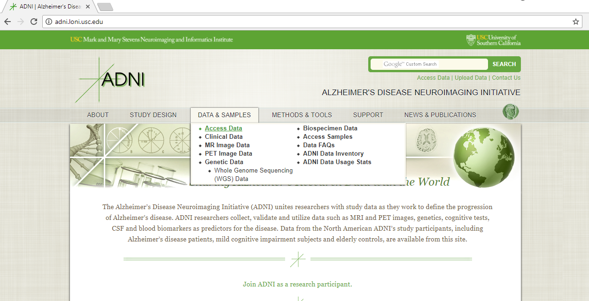
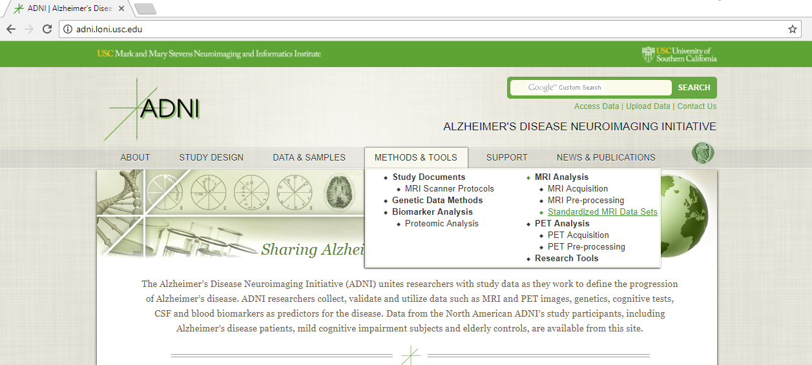

# [ADNI](http://adni.loni.usc.edu/)

## ADNI Data Access
**Registration** 
1. Go to ADNI ["Access Data"](http://adni.loni.usc.edu/data-samples/access-data/) page.   
  
2. Click the ADNI Button for the registration process, fill your information, and submit.
3. There is application review process about one week.

**Standardized MRI Data Sets** 
1. Go to the ["Standardized MRI Data Sets"](http://adni.loni.usc.edu/methods/mri-analysis/adni-standardized-data/) page after access granted.  
  
2. Following "How to Download" session to get image collection and study information.
3. All the 1.5T image collections are used in the project.

The Image collections list:
   1. `ADNI1:Annual 2 Yr 1.5T`
   1. `ADNI1:Complete 1Yr 1.5T`
   1. `ADNI1:Complete 2Yr 1.5T`
   1. `ADNI1:Complete 3Yr 1.5T`
   1. `ADNI1:Screening 1.5T`
4. Two study information lists `ADNI 1.5Y MRI Standardized Lists` and `Key ADNI tables merged into one table` are used in the project.

----

## Study Information
The `ADNI 1.5Y MRI Standardized Lists` contains all the five image collections information, and a piece of table are shown below.

|RID|Image.ID|PTID|Screen.Diagnosis|Visit|Scan.Date|Sequence|Study.ID|Series.ID|
|:----:|:----:|:----:|:----:|:----:|:----:|:----:|:----:|:----:|
|2|35475|011_S_0002|NL|Screening|8/26/05|MPR; GradWarp; B1 Correction; N3; Scaled|1945|9107|
|3|32237|011_S_0003|AD|Screening|2009/1/5|MPR-R; GradWarp; B1 Correction; N3; Scaled|1948|9127|

The `Screen.Diagnosis` shows the diagnosis result of each image. This project focus on `NL` and `AD` subjects images, the `MCI` is not involved in this project. The `Screen.Diagnosis` column is the data label of DL module. The `Sequence` shows the ADNI image corrections operations. Please check ["MRI Pre-processing"](http://adni.loni.usc.edu/methods/mri-analysis/mri-pre-processing/) page for the detail information, it impacts the following pre-processing project pipeline.

The `Key ADNI tables merged into one table` contains all the key information of ADNI, it is used for grouping of subjects data. Example, the study focuses on pure NL and AD subjects, the subjects who changed for NL to AD are not involved in the project, it needs `Key ADNI tables merged into one table` to trace the subject' history diagnosis.

----
