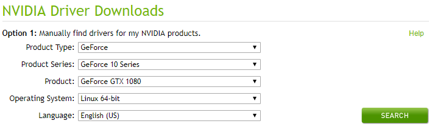
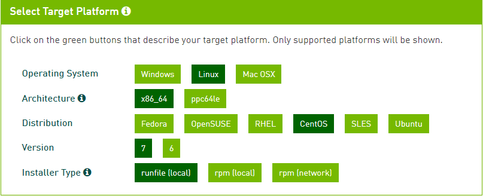
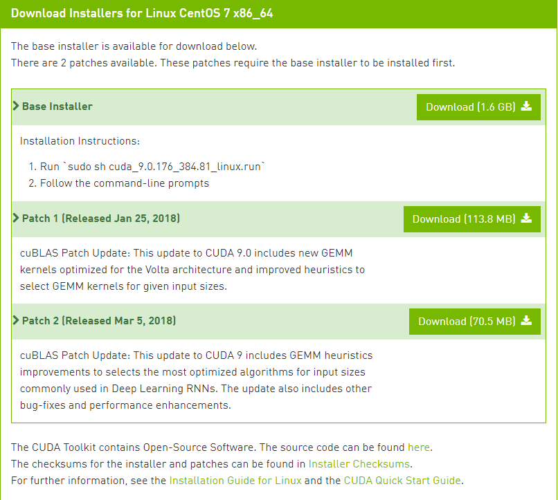
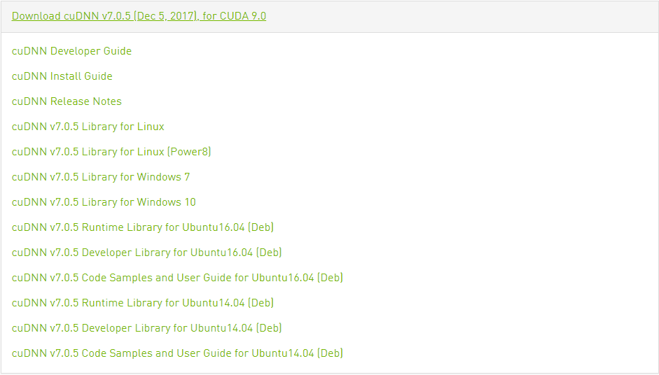

# Installation Introduction
The ADDL project are based on Bash, R and Python programming language. The project algorithm and interface develop in Python. Plenty of third party tools are involved in this project, the Bash, R and Python also work as script language. The project only support Linux. Our working operation system(OS) is CentOS7.

The installation of project is very easy, just source copy. But the third party tools setting up cost a lot. The project pends on two independent types of tool set, the neuroimaging processing tool set and deep learning(DL) tool set. Considering the dependency of software versions, OS and hardware, this section introduces a full process to setup all the required tools based on the CentOS7 minimal installation.

***The 3rd Party Tools Structure***<br>
* Deep learning tool set
  * GPU vender provided tools
    * Driver
    * CUDA
    * cuDNN
  * Deep learning framework
    * Anaconda
    * TensorFlow
    * TFLearn
* Neuroimaging processing tool set
  * FSL
  * ANTsR
  * Nibabel
  * OpenCV

# After CentOS7 Minimal Installation
Assuming one has installed CentOS7 minimal, enabling the network, and the SSH staff. The project required some dependency packages and an account named python2.

**Install Project Pending Packages Commands**<br>
```bash
# Necessary  tools.
yum install -y wget
yum install -y git
yum install -y bzip2
yum install -y screen

# Headers for R package sources build installation.
yum install -y kernel-devel-$(uname -r)
yum install -y kernel-headers-$(uname -r)
yum install -y libXmu-devel
yum install -y libXi-devel
yum install -y libcurl-devel
yum install -y openssl-devel
yum install -y libpng-devel
yum install -y libX11-devel
yum install -y mesa-libGL-devel
yum install -y mesa-libGLU-devel
yum install -y ImageMagick-c++-devel

# Compiler for R packages source build.
yum install -y gcc
yum install -y gcc-c++

# Install R from EPEL
yum install -y epel-release
yum install -y R
```

**Create Account Commands**<br>
```bash
# Check a user is valid, e.g. python2
getent passwd python2

# Create a user named python2
useradd python2

# Assign a password to python2, e.g. abc123
echo abc123 | passwd python2 --stdin

# Optional if you want assign python2 sudo with password.
usermod -aG wheel python2
```  

# Deep Learning Tool Set
Currently, GPU is the most common computation accelerator for DL algorithm. The DL tool set is typically divided into two suits, the hardware vender provided tools and the DL framework. The hardware vender provided tools contain driver(interface of device and OS), CUDA(the general GPU computation framework) and cuDNN(the DL algorithm optimization library). The DL framework connects developer and hardware, it helps developer achieve DL application easily and fast, and taking the hardware work efficiently. There are lots of DL frameworks such as TensorFlow, Caffe2, PyTorch, etc. This project is using TensorFlow, that is the most common DL framework.

## Determination Versions
There are native dependency and latency between hardware vender provide tools and DL frameworks, so the latest version of DL framework is a bit later than the latest version of hardware vender provided tools. One should take care of the versions of DL tools. Building a local version of DL framework pends on your local hardware vender provided tool for the edge features is out of this document scoping. Driver is usually backward compatible, the latest one should be fine because Driver, CUDA and cuDNN are good maintained inside hardware vender.

The TensorFlow official provides detail GPU tools requirement, please check [here](https://www.tensorflow.org/install/install_linux#NVIDIARequirements) for detail information. Till this document, the latest stable TensorFlow version is [1.6](https://github.com/tensorflow/tensorflow/releases/tag/v1.6.0), and the NVIDIA tool set requirement are shown below.
* CUDA = 9.0
* cuDNN = 7.0

## GPU Vender Provided Tools

### [Driver](http://www.nvidia.com/Download/index.aspx)
Select the suitable driver base on your OS and GPU device from the NVIDIA driver download address(https://www.nvidia.com/drivers). The example GPU is **GeForce GTX 1080**.

Specially, the native GPU driver of CentOS is Noveau, which is a third party open source driver for NVIDIA cards, but poor support for the DL computation, so we need remove it before install the formal one. The following steps show the download and install detail process.

**Download**<br>
1. Manually find the drivers at [link](https://www.nvidia.com/drivers). Select the matching fields from the drop box listed below; and then click the "SEARCH" button for the search result page.<br><br>
<br><br>
1. Click the "DOWNLOAD" button at the search result page for the driver download url.
1. Click the "AGREE & DOWNLOAD" button downloading directly at the download confirmation page, or right click the button for the download url.

Downloaded package is `NVIDIA-Linux-x86_64-390.25.run`.

**Remove Noveau Driver Command**<br>
```bash
# Check nouveau driver is installed.
lsmod | grep nouveau

# Disable nouveau driver.
touch /etc/modprobe.d/blacklist-nouveau.conf
echo "blacklist nouveau
options nouveau modeset=0" > /etc/modprobe.d/blacklist-nouveau.conf
mv /boot/initramfs-$(uname -r).img /boot/initramfs-$(uname -r).img.bak
dracut -v /boot/initramfs-$(uname -r).img $(uname -r)
reboot
```

Note: There is reboot process during driver installation.

**Install NVDIA Driver Command**<br>
```bash
# Check nvida driver is installed.
lsmod | grep nvidia

# Install nvida driver without interaction.
bash NVIDIA-Linux-x86_64-390.25.run --silent
```

### [CUDA](https://developer.nvidia.com/cuda-zone)
Select the suitable CUDA version base on TenorFlow requirement, and select the suitable package base on the OS. The following steps show the download and install detail process.

**Download**<br>
1. Manually find the CUDA 9.0 from the [archive page](https://developer.nvidia.com/cuda-toolkit-archive),
1. Select the matching fields of the check box from the CUDA download page listed below.<br><br>
 <br><br>
1. The CUDA and patch packages are listed below, the download url is at the "Download" button.<br><br>
<br><br>

Downloaed Packages
* `cuda_9.0.176_384.81_linux.run`
* `cuda_9.0.176.1_linux.run`
* `cuda_9.0.176.2_linux.run`

**Install CUDA Command**<br>
```bash
bash cuda_9.0.176_384.81_linux.run --silent
bash cuda_9.0.176.1_linux.run --silent --installdir=/usr/local/cuda --accept-eula
bash cuda_9.0.176.2_linux.run --silent --installdir=/usr/local/cuda --accept-eula
```

### [cuDNN](https://developer.nvidia.com/cudnn)
The cuDNN is a CUDA library used for DL compuation, the installation process is a binary copy process, one should exactly select the version basing on your environment. The cuDNN download and installation detail process are listed below.

**Download**<br>
1. Download a cuDNN package requires registration as a NVIDIA Developer. Click "Join" button of the NVIDA developer [main page](https://developer.nvidia.com/) to finished the register process, if one is not assigned.
1. Goto the cuDNN [download page](https://developer.nvidia.com/rdp/cudnn-download), and enable the check box of "cuDNN software license agreement".
1. Select the cuDNN v7.0.5 for CUDA 9.0 as the TensorFlow requirement, and get the dropdown selections.<br><br>
<br><br>
1. Get the download url of the cuDNN package from the "cuDNN v7.0.5 Library for Linux" selection.

Note: If your downloaded package is named `cudnn-9.0-linux-x64-v7.solitairetheme8`, the suffix solitairetheme8 is Microsoft Solitaire Collection caused, rename it to tgz should be fine.

**Install cuDNN Command**<br>
```bash
# Rename the downloaded cuDNN package.
mv cudnn-9.0-linux-x64-v7.solitairetheme8 cudnn-9.0-linux-x64-v7.tgz

# Install with unpackaging the cuDNN package.
tar xzvf cudnn-9.0-linux-x64-v7.tgz -C /usr/local
```

## Deep Learning Framework

### [Anaconda](https://www.anaconda.com/)
Anaconda is a freemium open source distribution of the Python and R programming languages for large-scale data processing, predictive analytics, and scientific computing, that aims to simplify package management and deployment. Package versions are managed by the package management system conda.

The project using Anaconda Python environment instead of CentOS7 native python environment to avoid OS dependency. And Anaconda Python2.7 is installed at a normal user account named python2.

**Download**<br>
Select a latest Anaconda2 package base on the OS from the archive [url](https://repo.continuum.io/archive/).

Downloaded package is `Anaconda2-5.1.0-Linux-x86_64.sh`.

**Install Anaconda Command**<br>
```bash
# Install Anaconda at python2 account.
bash Anaconda2-5.1.0-Linux-x86_64.sh -b

# Assign Anaconda executions the first priority.
echo "export PATH=\"$HOME/anaconda2/bin:\$PATH\"" >> $HOME/.bashrc
source $HOME/.bashrc

# Option: Add nearest conda mirror.
conda config --add channels https://mirrors.tuna.tsinghua.edu.cn/anaconda/pkgs/free/
conda config --add channels https://mirrors.tuna.tsinghua.edu.cn/anaconda/pkgs/main/
conda config --set show_channel_urls yes
```

### [TensorFlow](https://www.tensorflow.org/)
TensorFlow™ is an open source software library for high performance numerical computation. Its flexible architecture allows easy deployment of computation across a variety of platforms (CPUs, GPUs, TPUs), and from desktops to clusters of servers to mobile and edge devices. Originally developed by researchers and engineers from the Google Brain team within Google’s AI organization, it comes with strong support for machine learning and deep learning and the flexible numerical computation core is used across many other scientific domains.

**Download**<br>
Please check the download [url](https://www.tensorflow.org/install/install_linux#the_url_of_the_tensorflow_python_package), and select "Python2.7" and "GPU support" to get the TensorFlow package url `https://storage.googleapis.com/tensorflow/linux/gpu/tensorflow_gpu-1.6.0-cp27-none-linux_x86_64.whl`.

**Install TensorFlow Command**<br>
```bash
# The installation process contains some dependency package installation.
# If your pip downloading slowly, please change a fast PyPI mirror.
pip install tensorflow_gpu-1.6.0-cp27-none-linux_x86_64.whl

# Assign CUDA environment variables suits for TensorFlow GPU.
echo "export PATH=\"/usr/local/cuda/bin:\$PATH\"" >> $HOME/.bashrc
echo "export LD_LIBRARY_PATH=\"/usr/local/cuda/lib64:\$LD_LIBRARY_PATH\"" >> $HOME/.bashrc
echo "export CUDA_HOME=\"/usr/local/cuda\"" >> $HOME/.bashrc
source $HOME/.bashrc
```

### [TFLearn](http://tflearn.org/)
TFLearn is a modular and transparent deep learning library built on top of TensorFlow. It was designed to provide a higher-level API to TensorFlow in order to facilitate and speed-up experimentations, while remaining fully transparent and compatible with it. The PyPI/pip support TFLearn package installation.

The project implements DL models with TFLearn.

**Install TFLearn Command**<br>
```bash
pip install tflearn
```

#### Set PyPI Mirror
Please use your prefer PyPI mirror. For example setting mirror `https://pypi.tuna.tsinghua.edu.cn/simple` as the default PyPI mirror.

**Temporary Usage**<br>
```bash
pip install -i https://pypi.tuna.tsinghua.edu.cn/simple some-package
```

**Default Setting**<br>
Fill the following context to file `~/.config/pip/pip.conf`.
```
[global]
index-url = https://pypi.tuna.tsinghua.edu.cn/simple
```

----

# Neuroimaging Processing Tool Set
The rapid progress of research in the neuroscience and neuroimaging fields has been accompanied by the development of many excellent analysis software tools. These are implemented in a variety of computer languages and programming environments. This project take use of two packages FSL and ANTsR for brain extraction, registration, grey matter extraction etc.

----

## [FSL](http://www.fmrib.ox.ac.uk/fsl/)
FSL is a comprehensive library of analysis tools for FMRI, MRI and DTI brain imaging data. It runs on Apple and PCs (both Linux, and Windows via a Virtual Machine), and is very easy to install. Most of the tools can be run both from the command line and as GUIs ("point-and-click" graphical user interfaces). To quote the relevant references for FSL tools you should look in the individual tools' manual pages.

The FSL download and install is easy, that handle with a FSL install tool named `fslintaller.py`. But the FSL install package is more than 2G, we suffered install fail caused by download fail, so we suggest offline download package first. The detail download and install process are listed below.

**Download**<br>
1. Download the FSL install tool from url `https://fsl.fmrib.ox.ac.uk/fsldownloads/fslinstaller.py`.
1. Get the FSL package url base on OS from FSL install tools.
   1. Search the `download_file()` function defination in the `fslinstaller.py`, adding the print url code.
```python
def download_file(url, localf, timeout=20):
    '''Get a file from the url given storing it in the local file specified'''
    print url # Hey,new adding here!
    try:
        rf = open_url(url, 0, timeout)
    except OpenUrlError, e:
        raise DownloadFileError(str(e))
```

   1. Get the FSL package url by the following command, and then Control-c.
```bash
python fslinstaller.py -o
```

The FSL package url is `https://fsl.fmrib.ox.ac.uk/fsldownloads/fsl-5.0.10-centos7_64.tar.gz`.

**Install FSL Command**<br>
```bash
python fslinstaller.py -f fsl-5.0.10-centos7_64.tar.gz -M -d /usr/local/fsl -q
```

----

## [ANTsR](https://github.com/ANTsX/ANTsR)
ANTsR is a package providing ANTs features in R as well as imaging-specific data representations, spatially regularized dimensionality reduction and segmentation tools.

ANTsR interfaces state of the art image processing with R statistical methods. The project grew out of the need, at University of Pennsylvania, to develop large-scale analytics pipelines that track provenance from scanner to scientific study. ANTsR wraps an ANTs and ITK C++ core via Rcpp to access these frameworks from within R and support reproducible analyses. Specialized functionality in ANTsR includes image segmentation and registration along imaging specific variations of principal component and canonical correlation analysis.

### Introduction
**[R](https://www.r-project.org)**<br>
R is a freely available language and environment for statistical computing and graphics which provides a wide variety of statistical and graphical techniques: linear and nonlinear modelling, statistical tests, time series analysis, classification, clustering, etc.

**[INK](https://itk.org)**<br>
ITK is an open-source software toolkit for performing registration and segmentation. Segmentation is the process of identifying and classifying data found in a digitally sampled representation. Typically, the sampled representation is an image acquired from such medical instrumentation as CT, MRI or ultrasound scanners. Registration is the task of aligning or developing correspondences between data. For example, in the medical environment, a CT scan may be aligned with a MRI scan in order to combine the information contained in both.

**[INKR](http://github.com/stnava/ITKR)**<br>
ITKR provides R-based access to the Insight ToolKit (ITK) for medical image processing, registration and segmentation.

**[ANTs](http://stnava.github.io/ANTs)**<br>
The ANTS framework provides open-source functionality for deformable normalization with large deformations. Small deformation mappings and segmentation tools are also available.  Developer evaluation showed stronger differences with other methodology in neurodegenerative neuroimaging data, where large deformation is required. ANTs serves as both a base for further algorithm development and also as an application-oriented toolkit. ANTS enable diffeomorphic normalization with a variety of transformation models, optimal template construction, multiple types of diffeomorphisms, multivariate similarity metrics, diffusion tensor processing and warping, image segmentation with and without priors and measurement of cortical thickness from probabilistic segmentations. The normalization tools, alone, provide a near limitless range of functionality and allow the user to develop customized objective functions. Objective functions in ANTS are of the form: Deformation Cost + Data Terms, and the command line reflects this balance of two terms. As mentioned above, the data term may combine multiple different measures of similarity that are optimized in parallel, for instance, image similarity and landmark terms.

**[ANTsRCore](https://github.com/ANTsX/ANTsRCore)**<br>
A package providing core features for ANTsR.

**[Extrantsr](https://github.com/muschellij2/extrantsr)**<br>
Extrantsr extends the ANTsR package with simple wrappers and complex processing streams for neuroimaging data.

### Installation
The ANTsR installation is a high cost process, which contains package download and source build process. Try to accelerator the process please choosing a CPAN mirror nearly, and assign more threads for the build process. The Extrantsr contains ANTsR install process.

**Install Extrantsr Commands**<br>
```bash
# Install R
yum install -y epel-release
yum install -y R

# Install pending packages, using the specify CRAN mirror.
# Source build process.
install.package("optparse",    repos="https://mirrors.ustc.edu.cn/CRAN", dependencies=TRUE)
install.package("bitops",      repos="https://mirrors.ustc.edu.cn/CRAN", dependencies=TRUE)
install.package("abind",       repos="https://mirrors.ustc.edu.cn/CRAN", dependencies=TRUE)
install.package("neurobase",   repos="https://mirrors.ustc.edu.cn/CRAN", dependencies=TRUE)
install.package("matrixStats", repos="https://mirrors.ustc.edu.cn/CRAN", dependencies=TRUE)
install.package("R.utils",     repos="https://mirrors.ustc.edu.cn/CRAN", dependencies=TRUE)
install.package("rgl",         repos="https://mirrors.ustc.edu.cn/CRAN", dependencies=TRUE)
install.package("R.matlab",    repos="https://mirrors.ustc.edu.cn/CRAN", dependencies=TRUE)
install.package("neuroim",     repos="https://mirrors.ustc.edu.cn/CRAN", dependencies=TRUE)
install.package("magic",       repos="https://mirrors.ustc.edu.cn/CRAN", dependencies=TRUE)
install.package("psych",       repos="https://mirrors.ustc.edu.cn/CRAN", dependencies=TRUE)
install.package("rsvd",        repos="https://mirrors.ustc.edu.cn/CRAN", dependencies=TRUE)
install.package("RcppEigen",   repos="https://mirrors.ustc.edu.cn/CRAN", dependencies=TRUE)
install.package("WhiteStripe", repos="https://mirrors.ustc.edu.cn/CRAN", dependencies=TRUE)
install.package("fslr",        repos="https://mirrors.ustc.edu.cn/CRAN", dependencies=TRUE)
install.package("oro.nifti",   repos="https://mirrors.ustc.edu.cn/CRAN", dependencies=TRUE)
install.package("devtools",    repos="https://mirrors.ustc.edu.cn/CRAN", dependencies=TRUE)

#R CMD INSTALL ITKR_0.4.12_R_x86_64-pc-linux-gnu.tar.gz
#R CMD INSTALL ANTsRCore_0.4.2.1_R_x86_64-pc-linux-gnu.tar.gz
#R CMD INSTALL ANTsR_0.6_R_x86_64-pc-linux-gnu.tar.gz

# Install extrantsr
devtools::install_github("muschellij2/extrantsr")
```

**[CRAN](https://cran.r-project.org)**<br>
CRAN is a network of ftp and web servers around the world that store identical, up-to-date, versions of code and documentation for R. Please use the CRAN mirror(`https://cran.r-project.org/mirrors.html`) nearest to you to minimize network load.

----

## [Nibabel](http://nipy.org/nibabel/)
This package provides read/write access to some common medical and neuroimaging file formats, including: ANALYZE (plain, SPM99, SPM2 and later), GIFTI, NIfTI1, NIfTI2, MINC1, MINC2, MGH and ECAT as well as Philips PAR/REC. We can read and write FreeSurfer geometry, annotation and morphometry files. There is some very limited support for DICOM. NiBabel is the successor of PyNIfTI.

This project taking use of Nibabel for neuroimaging to image data transfer.

**Install nibabel Command**<br>
```bash
pip install nibabel
```

----

## [OpenCV](https://opencv.org/)
OpenCV (Open Source Computer Vision Library) is released under a BSD license and hence it’s free for both academic and commercial use. It has C++, Python and Java interfaces and supports Windows, Linux, Mac OS, iOS and Android. OpenCV was designed for computational efficiency and with a strong focus on real-time applications. Written in optimized C/C++, the library can take advantage of multi-core processing. Enabled with OpenCL, it can take advantage of the hardware acceleration of the underlying heterogeneous compute platform.

**Install opencv-python Command**<br>
```bash
pip install opencv-python
```

----

# All in One Script
To simplify the 3rd party tools setup process, we integrate all the process in one script [`setup_env.sh`](../tools/setup_env/setup_env.sh), and it requires pre-download some packages at `$ADDLROOT/tools/setup_env/pkg/`. And the packages are listed below.
1. [NVIDIA-Linux-x86_64-390.25.run](http://us.download.nvidia.com/XFree86/Linux-x86_64/390.25/NVIDIA-Linux-x86_64-390.25.run)
1. [cuda_9.0.176_384.81_linux.run](https://developer.nvidia.com/compute/cuda/9.0/Prod/local_installers/cuda_9.0.176_384.81_linux-run)
1. [cuda_9.0.176.1_linux.run](https://developer.nvidia.com/compute/cuda/9.0/Prod/patches/1/cuda_9.0.176.1_linux-run)
1. [cuda_9.0.176.2_linux.run](https://developer.nvidia.com/compute/cuda/9.0/Prod/patches/2/cuda_9.0.176.2_linux-run)
1. [cudnn-9.0-linux-x64-v7.tgz](https://developer.nvidia.com/compute/machine-learning/cudnn/secure/v7.0.5/prod/9.0_20171129/cudnn-9.0-linux-x64-v7)
1. [Anaconda2-5.1.0-Linux-x86_64.sh](https://repo.continuum.io/archive/Anaconda2-5.1.0-Linux-x86_64.sh)
1. [tensorflow_gpu-1.6.0-cp27-none-linux_x86_64.whl](https://storage.googleapis.com/tensorflow/linux/gpu/tensorflow_gpu-1.6.0-cp27-none-linux_x86_64.whl)
1. [fslinstaller.py](https://fsl.fmrib.ox.ac.uk/fsldownloads/fslinstaller.py)
1. [fsl-5.0.10-centos7_64.tar.gz](https://fsl.fmrib.ox.ac.uk/fsldownloads/fsl-5.0.10-centos7_64.tar.gz)
1. [ITKR_0.4.12_R_x86_64-pc-linux-gnu.tar.gz](https://github.com/stnava/ITKR/releases/download/latest/ITKR_0.4.12_R_x86_64-pc-linux-gnu.tar.gz)
1. [ANTsRCore_0.4.2.1_R_x86_64-pc-linux-gnu.tar.gz](https://github.com/ANTsX/ANTsRCore/releases/download/v0.4.2.1/ANTsRCore_0.4.2.1_R_x86_64-pc-linux-gnu.tar.gz)
1. [ANTsR_0.6_R_x86_64-pc-linux-gnu.tar.gz](https://github.com/ANTsX/ANTsR/releases/download/latest/ANTsR_0.6_R_x86_64-pc-linux-gnu.tar.gz)

**Instell Command**<br>
1. Go to the `$ADDLROOT/tools/setup_env` folder.
1. Launch the install script with root, there is a reboot process for the GPU driver update.
```bash
sudo bash setup_env.sh
```

Note: if some packages download slowly and cause install process fail, please update the package mirror according this document.
